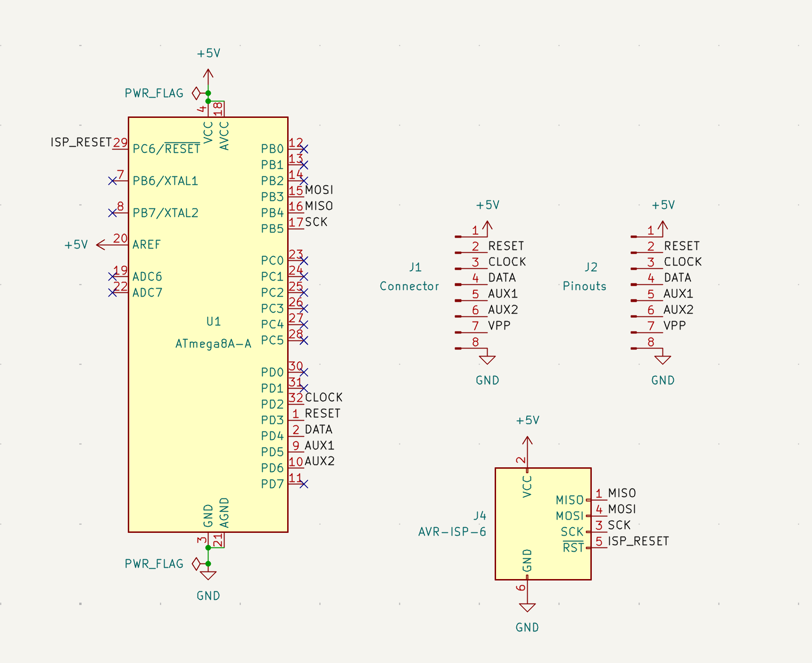
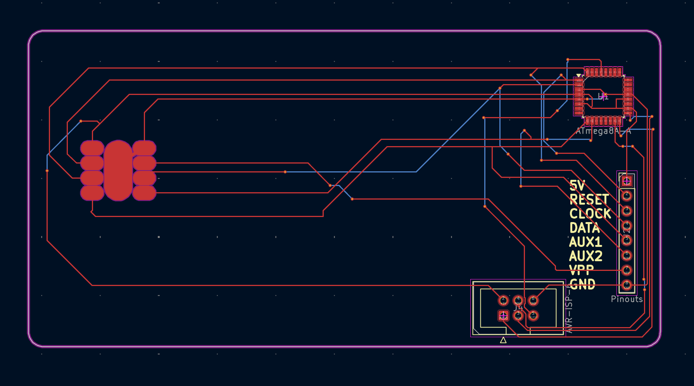
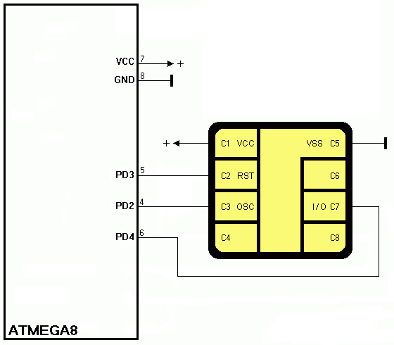

# SLE4442 Emulator
This is a smartcard emulator for ATMEGA8 microcontroller.

## Schematic


## Schematic


## Instructions
- Modify the "memory.h" file with the data of the card that you want to emulate
- If you compile the file with "#define BACKDOOR" uncommented, you will emulate a card that will be unlocked using any PSC code. Also, the PSC code sent by the reader will be updated immediately on the Security memory.  
- **WARNING**  
The maximum input clock frequency will be around 35KHz, not the 50KHz specified in the SLE4442 datasheet. I've tried my best to optimize the code but this is the main limitation of this project, you can try to use an external 16MHz clock for a better performance.


Real scheme used from https://github.com/sonovice/sle4442.

# Programming instruction
```
brew tap osx-cross/avr
brew install avr-gcc avrdude
```

The following commands are for USBasp programmer. For other programmers, look at the avrdude documentation.  

## Writing fuses
Execute those commands only one time, no need to write fuses every time you burn the flash.
```
make fuses
```

## Burning
Go in `code` folder. Execute this command:

```
make flash
```

## Read EEPROM
Once the PSC is grabbed, you can read the microcontroller EEPROM using this command:
```
make read
```

Open **eeprom.hex** with a text editor, PSC is present here:

